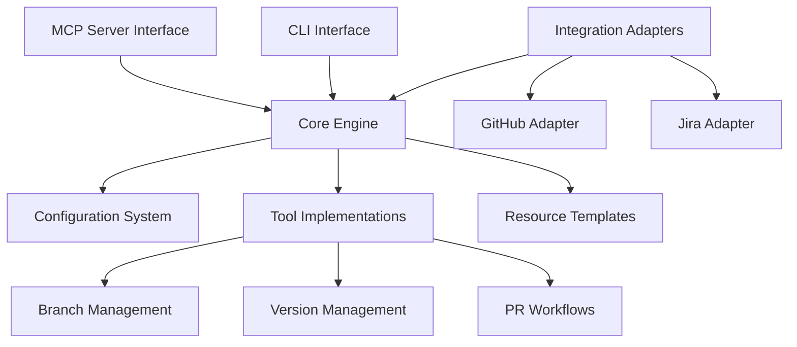

# Developer Documentation

This document provides technical information for developers working on or extending the Practices MCP Server.

## Table of Contents

- [Architecture](#architecture)
- [Project Structure](#project-structure)
- [Development Environment](#development-environment)
- [MCP Server Implementation](#mcp-server-implementation)
- [Core Components](#core-components)
- [Testing](#testing)
- [MCP Integration](#mcp-integration)
- [Contributing](#contributing)

## Architecture

The Practices MCP Server follows a modular architecture designed for extensibility and maintainability:



### Design Patterns

The server uses several key design patterns:

1. **Adapter Pattern** - For external integrations (GitHub, Jira)
2. **Factory Pattern** - For creating objects based on configuration
3. **Template Method Pattern** - For standardizing workflows
4. **Command Pattern** - For CLI operations
5. **Dependency Injection** - For decoupling components

## Project Structure

```
mcp_server_practices/
├── src/
│   └── mcp_server_practices/       # Main package
│       ├── __init__.py             # Version info
│       ├── mcp_server.py           # MCP server implementation
│       ├── version/                # Version management
│       │   ├── __init__.py
│       │   ├── validator.py
│       │   └── bumper.py
│       ├── branch/                 # Branch management
│       │   ├── __init__.py
│       │   ├── validator.py
│       │   └── creator.py
│       ├── pr/                     # PR handling
│       │   ├── __init__.py
│       │   ├── generator.py
│       │   └── workflow.py
│       ├── integrations/           # External integrations
│       │   ├── __init__.py
│       │   ├── github.py
│       │   └── jira.py
│       ├── templates/              # Resource templates
│       │   ├── __init__.py
│       │   └── system_instructions.md
│       ├── headers/                # License header management
│       │   ├── __init__.py
│       │   ├── manager.py
│       │   └── templates.py
│       ├── hooks/                  # Pre-commit hooks management
│       │   ├── __init__.py
│       │   ├── installer.py
│       │   └── templates.py
│       ├── tools/                  # MCP tool implementations
│       │   ├── __init__.py
│       │   ├── branch_tools.py
│       │   ├── version_tools.py
│       │   ├── pr_tools.py
│       │   ├── git_tools.py
│       │   ├── license_tools.py
│       │   ├── github_tools.py
│       │   └── directory_tools.py
│       └── utils/                  # Utilities
│           ├── __init__.py
│           ├── directory_utils.py
│           └── global_context.py
├── tests/                          # Test suite
│   ├── unit/                       # Unit tests
│   └── integration/                # Integration tests
├── docs/                           # Documentation
├── instructions/                   # Implementation guidelines
├── .bumpversion.cfg                # Version management configuration
├── pyproject.toml                  # Package metadata
├── uv.lock                         # UV lock file
└── README.md                       # User documentation
```

## Development Environment

### Prerequisites

- Python 3.12+
- Git
- uv (next-generation Python package installer and resolver)

### Setting Up the Development Environment

1. Clone the repository:
   ```bash
   git clone https://github.com/Agentience/mcp_server_practices.git
   cd mcp_server_practices
   ```

2. Create a virtual environment using uv:
   ```bash
   uv venv
   source .venv/bin/activate  # On Windows: .venv\Scripts\activate
   ```

3. Install the package in development mode:
   ```bash
   uv pip install -e ".[dev]"
   ```

4. Install dependencies from the lock file:
   ```bash
   uv pip sync uv.lock
   ```

5. For global installation using UV:
   ```bash
   # Build the package wheel first
   python -m build
   
   # Install the wheel directly
   uv tool install dist/mcp_server_practices-0.3.0-py3-none-any.whl
   ```
   
   > **Important**: When using UV tool for installation, always build a wheel first and install the wheel file.
   > Using `uv tool install .` directly on the source directory can result in corrupted files in the installed package.

### Development Workflow

1. Create a feature branch:
   ```bash
   git checkout develop
   git pull origin develop
   git checkout -b feature/PMS-XXX-your-feature-description
   ```

2. Implement your changes

3. Run tests:
   ```bash
   PYTHONPATH=./src python -m pytest tests/
   ```

4. Commit your changes with meaningful commit messages:
   ```bash
   git commit -m "PMS-XXX: Brief description of changes"
   ```

5. Push your branch and create a pull request:
   ```bash
   git push origin feature/PMS-XXX-your-feature-description
   ```

## MCP Server Implementation

The server uses a decorator-based implementation for MCP tools and resources:

```python
from mcp.server import tool, start_server

@tool("validate_branch_name")
def validate_branch_name(*, branch_name: str):
    """Validate a branch name against the configured branching strategy."""
    # Implementation here
    return {"valid": True, "message": "Branch name is valid"}

@tool("create_branch")
def create_branch(*, branch_type: str, identifier: str, description: str = None, update_jira: bool = True):
    """Create a new branch following the branching convention."""
    # Implementation here
    return {"created": True, "branch_name": f"{branch_type}/{identifier}-{description}"}

if __name__ == "__main__":
    start_server()
```

## Core Components

### Branch Management

The branch management module provides functionality for:

- Validating branch names against configured patterns
- Creating branches with standardized naming
- Extracting information from branch names
- Integrating with Jira for issue status updates

Key files:
- `branch/validator.py` - Branch name validation
- `branch/creator.py` - Branch creation logic
- `tools/branch_tools.py` - MCP tool implementations

### Version Management

The version management module handles:

- Checking version consistency across files
- Bumping version numbers using semantic versioning
- Updating CHANGELOG.md with version history

Key files:
- `version/validator.py` - Version consistency checking
- `version/bumper.py` - Version bumping logic
- `tools/version_tools.py` - MCP tool implementations

### PR Workflows

The PR module provides:

- PR description generation based on branch information
- PR preparation and validation
- GitHub integration for PR creation

Key files:
- `pr/generator.py` - PR description generation
- `pr/workflow.py` - PR preparation workflow
- `pr/templates.py` - PR description templates
- `tools/pr_tools.py` - MCP tool implementations

### License Header Management

The headers module handles:

- Adding license headers to source files
- Verifying headers exist and are correct
- Templates for different file types

Key files:
- `headers/manager.py` - License header management
- `headers/templates.py` - License header templates
- `tools/license_tools.py` - MCP tool implementations

### Pre-commit Hooks

The hooks module provides:

- Pre-commit hooks installation and management
- Hook templates for different project types
- Verification of hook installation

Key files:
- `hooks/installer.py` - Pre-commit hooks installation
- `hooks/templates.py` - Hook configuration templates
- `tools/git_tools.py` - Related tool implementations

### Directory Tools

The directory tools module handles:

- Working directory management
- Logging configuration
- File paths and system instructions

Key files:
- `utils/directory_utils.py` - Directory utilities
- `utils/global_context.py` - Global context management
- `tools/directory_tools.py` - MCP tool implementations

## Testing

### Testing Strategy

The project uses a comprehensive testing approach:

1. **Unit Tests** - For testing individual components in isolation
2. **Integration Tests** - For testing interactions between components
3. **End-to-End Tests** - For testing complete workflows

### Running Tests

```bash
# Run all tests
PYTHONPATH=./src python -m pytest tests/

# Run specific test file
PYTHONPATH=./src python -m pytest tests/unit/test_branch_validator.py

# Run with coverage
PYTHONPATH=./src python -m pytest tests/ --cov=src
```

### Mock Object Pattern

Tests use mock objects for external dependencies:

```python
def test_github_adapter(mocker):
    mock_github = mocker.patch('mcp_server_practices.integrations.github.github_mcp')
    mock_github.create_pr.return_value = {"number": 42, "html_url": "https://github.com/..."}

    adapter = GitHubAdapter(config)
    result = adapter.create_pr(...)

    assert result["pr_number"] == 42
    mock_github.create_pr.assert_called_once()
```

### Test Guidelines

- Each new feature should have corresponding tests
- Tests should cover both success and failure cases
- Edge cases should be tested
- Integration tests should use mock objects for external services

## MCP Integration

### Jira Tool Examples

The Jira MCP server provides several tools for interacting with Jira issues. Here are common usage examples:

1. **Create a new issue**
```xml
<use_mcp_tool>
<server_name>jira-server</server_name>
<tool_name>create_issue</tool_name>
<arguments>
{
  "projectKey": "PMS",
  "summary": "Implement documentation examples",
  "issueType": "Task",
  "description": "Add Jira tool examples to developer documentation",
  "labels": ["documentation", "PMS-7"],
  "priority": "High"
}
</arguments>
</use_mcp_tool>
```

2. **Get issues for a project**
```xml
<use_mcp_tool>
<server_name>jira-server</server_name>
<tool_name>get_issues</tool_name>
<arguments>
{
  "projectKey": "PMS",
  "jql": "status != Done ORDER BY created DESC"
}
</arguments>
</use_mcp_tool>
```

3. **Update an existing issue**
```xml
<use_mcp_tool>
<server_name>jira-server</server_name>
<tool_name>update_issue</tool_name>
<arguments>
{
  "issueKey": "PMS-7",
  "status": "In Progress",
  "assignee": "developer@example.com"
}
</arguments>
</use_mcp_tool>
```

### MCP Tool Registration

The server registers tools with the MCP system:

```python
@tool("validate_branch_name")
def validate_branch_name(*, branch_name: str):
    """Validate a branch name against the configured branching strategy."""
    # Implementation
    return result
```

### Keyword-Only Arguments Pattern

All MCP tool functions use keyword-only arguments to ensure compatibility with FastMCP:

```python
# CORRECT: Use keyword-only arguments
@tool("validate_branch_name")
def validate_branch_name(*, branch_name: str):  # Note the * before parameters
    # Implementation
    return result

# INCORRECT: Don't use positional arguments
@tool("validate_branch_name")
def validate_branch_name(branch_name: str):  # Missing *
    # Implementation
    return result
```

### Server Configuration

To use the Jira MCP server, add this configuration to your MCP settings:

```json
{
  "mcpServers": {
    "jira": {
      "command": "jira-server",
      "args": [],
      "env": {
        "JIRA_API_TOKEN": "your_api_token",
        "JIRA_URL": "https://your-company.atlassian.net"
      }
    }
  }
}
```

### Using the Server with Claude

To use the MCP server with Claude (both desktop and Cline VS Code extension), add it to the appropriate configuration file:

```json
{
  "mcpServers": {
    "practices": {
      "command": "practices",
      "args": ["server"],
      "disabled": false,
      "autoApprove": ["*"]
    }
  }
}
```

MCP settings file locations:
- MacOS: `~/Library/Application Support/Code/User/globalStorage/saoudrizwan.claude-dev/settings/cline_mcp_settings.json`
- Windows: `%APPDATA%\Code\User\globalStorage\saoudrizwan.claude-dev\settings\cline_mcp_settings.json`
- Linux: `~/.config/Code/User/globalStorage/saoudrizwan.claude-dev\settings\cline_mcp_settings.json`

## Contributing

### Development Process

1. Check the project's Jira board for available tasks or create a new issue
2. Create a branch following the naming convention:
   - `feature/PMS-XXX-description` for new features
   - `bugfix/PMS-XXX-description` for bug fixes
   - `docs/description` for documentation changes
3. Implement your changes with appropriate tests
4. Run the test suite to ensure all tests pass
5. Create a pull request with a standardized description
6. Address any feedback from code reviews

### Pull Request Guidelines

1. PRs should reference a Jira ticket in the title and description
2. PRs should contain appropriate tests
3. PRs should include updates to documentation when relevant
4. All CI checks should pass before merging

### Versioning Guidelines

The project follows Semantic Versioning 2.0.0:

- MAJOR version for incompatible API changes
- MINOR version for backwards-compatible new functionality
- PATCH version for backwards-compatible bug fixes

When contributing, do not modify version numbers in feature branches. Version updates are handled in release branches.

### Code Style

The project uses:
- Black for code formatting
- isort for import sorting
- flake8 for linting
- mypy for type checking

These are enforced by pre-commit hooks that should be installed:

```bash
practices hooks install
```

### Documentation Guidelines

- Keep API documentation up-to-date
- Update README.md for user-facing changes
- Update developer documentation for architectural changes
