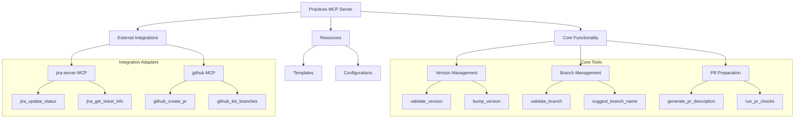

# Practices MCP Server - Architecture

## System Architecture

The Practices MCP Server is designed as a modular Python-based MCP server that provides tools and resources for implementing development best practices. It leverages existing MCP servers like GitHub and Jira while adding its own layer of workflow orchestration.



## Core Components

### 1. Version Management

Responsible for ensuring version consistency across project files and handling version bumping according to semantic versioning principles.

- **Version Validator**: Checks for version consistency across files
- **Version Bumper**: Automates version increments (major, minor, patch)
- **Version Configuration**: Handles project-specific version file patterns

### 2. Branch Management

Manages branch naming conventions, creation, and validation according to the configured branching strategy.

- **Branch Validator**: Validates branch names against configured patterns
- **Branch Creator**: Creates properly formatted branches
- **Base Branch Resolver**: Determines the correct base branch for a given branch type

### 3. PR Preparation

Handles pull request preparation, description generation, and pre-PR checks.

- **PR Description Generator**: Creates standardized PR descriptions based on branch information
- **PR Checker**: Runs pre-PR checks (tests, linting)
- **PR Submitter**: Coordinates with GitHub for PR creation

### 4. Configuration System

Manages project-specific configurations for branching strategies, version management, and PR templates.

- **Config Loader**: Loads and validates configuration files
- **Strategy Templates**: Provides templates for common branching strategies
- **Project Type Detection**: Auto-detects project type and suggests appropriate configurations

### 5. Integration Adapters

Connects with external MCP servers to provide seamless workflow integration.

- **Jira Adapter**: Interfaces with jira-server MCP
- **GitHub Adapter**: Interfaces with github MCP

## Directory Structure

```
mcp_server_practices/
├── src/
│   └── mcp_server_practices/       # Main package
│       ├── __init__.py             # Version info
│       ├── mcp_server.py           # MCP server implementation
│       ├── version/                # Version management
│       │   ├── __init__.py
│       │   ├── validator.py
│       │   └── bumper.py
│       ├── branch/                 # Branch management
│       │   ├── __init__.py
│       │   ├── validator.py
│       │   └── creator.py
│       ├── pr/                     # PR handling
│       │   ├── __init__.py
│       │   ├── generator.py
│       │   └── checker.py
│       ├── integrations/           # External integrations
│       │   ├── __init__.py
│       │   ├── github.py
│       │   └── jira.py
│       └── templates/              # Resource templates
│           ├── __init__.py
│           └── resources.py
```

## Data Flow

1. **Configuration Flow**:
   - Load project configuration from `.practices.yaml`
   - Apply configuration to branch validators, PR generators, etc.
   - Fall back to default templates when no configuration exists

2. **Branch Validation Flow**:
   - Receive branch name for validation
   - Parse using configured branch patterns
   - Extract components (type, ticket ID, description)
   - Return validation result and branch metadata

3. **PR Preparation Flow**:
   - Analyze current branch and extract metadata
   - Generate PR description from branch info and templates
   - Run pre-PR checks (tests, linting)
   - Communicate with GitHub MCP for PR creation

4. **Version Management Flow**:
   - Scan for version strings in configured files
   - Validate consistency across files
   - When bumping, update all version references
   - Ensure semantic versioning rules are followed

## MCP API Design

### Tools

The following MCP tools will be exposed:

1. **`validate_branch_name`**: Validate a branch name against conventions
2. **`get_branch_info`**: Extract information from a branch name
3. **`create_branch`**: Create a properly formatted branch
4. **`validate_version`**: Check version consistency
5. **`bump_version`**: Bump version according to rules
6. **`prepare_pr`**: Prepare pull request details
7. **`get_workflow_status`**: Get the current workflow status and next steps

### Resources

The following MCP resources will be exposed:

1. **`practices://templates/branching-strategy/{type}`**: Branching strategy templates
2. **`practices://templates/pr/{type}`**: PR templates by branch type
3. **`practices://templates/version-files/{lang}`**: Version file templates

## Security Considerations

- The server requires GitHub and Jira tokens when using those integrations
- All configuration is loaded from the local project to prevent remote code execution
- Branch creation and PR operations require explicit user configuration

## Scalability & Extension

The architecture is designed to be extendable in several ways:

1. **Additional Integration Adapters**: New adapters can be added for other MCP servers
2. **Custom Branch Strategies**: Users can define custom branch patterns and workflows
3. **Additional Project Types**: Support for specific language ecosystems can be extended
