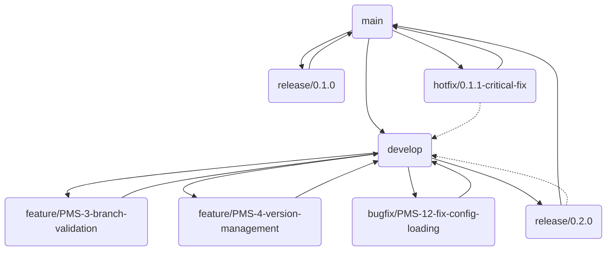

# Practices MCP Server - Branching Strategy

## Overview

This document outlines the branching strategy for the Practices MCP server project, which follows a modified GitFlow approach. The strategy is designed to support parallel development, stable releases, and hotfixes while maintaining clean version history.

## Branch Structure



## Core Branches

### `main` Branch

- Represents the official release history
- Always in a production-ready state
- Tagged with version numbers for each release
- Direct commits are not allowed

### `develop` Branch

- Integration branch for features and non-critical fixes
- Represents the next release state
- Contains all completed features for the upcoming release
- May not always be stable

## Supporting Branches

### Feature Branches

- **Naming Convention**: `feature/PMS-XXX-brief-description`
- **Created From**: `develop`
- **Merged Back Into**: `develop`
- **Purpose**: Development of new features
- **Version Bump**: None
- **Example**: `feature/PMS-3-branch-validation`

### Bugfix Branches

- **Naming Convention**: `bugfix/PMS-XXX-brief-description`
- **Created From**: `develop`
- **Merged Back Into**: `develop`
- **Purpose**: Fixes for non-critical bugs in the development process
- **Version Bump**: None
- **Example**: `bugfix/PMS-12-fix-config-loading`

### Release Branches

- **Naming Convention**: `release/X.Y.0`
- **Created From**: `develop`
- **Merged Back Into**: `main` and `develop`
- **Purpose**: Preparation for a new production release
- **Version Bump**: Minor or major version
- **Example**: `release/0.2.0`

### Hotfix Branches

- **Naming Convention**: `hotfix/X.Y.Z-brief-description`
- **Created From**: `main`
- **Merged Back Into**: `main` and `develop`
- **Purpose**: Critical fixes for production issues
- **Version Bump**: Patch version
- **Example**: `hotfix/0.1.1-critical-fix`

### Documentation Branches

- **Naming Convention**: `docs/brief-description`
- **Created From**: `develop`
- **Merged Back Into**: `develop`
- **Purpose**: Updates to documentation only
- **Version Bump**: None
- **Example**: `docs/update-readme`

## Branch Naming Rules

1. **Format**: `<type>/<jira-ticket>-<description>` or `<type>/<version>-<description>`
2. **Type**: One of `feature`, `bugfix`, `release`, `hotfix`, or `docs`
3. **Jira Ticket**: For feature and bugfix branches, include the Jira ticket ID (e.g., `PMS-3`)
4. **Version**: For release and hotfix branches, include the version number (e.g., `0.2.0`)
5. **Description**: Brief, hyphenated description of the change (e.g., `add-branch-validation`)

## Workflow Processes

### Feature Development Process

1. Create a new feature branch from `develop`:
   ```
   git checkout develop
   git pull origin develop
   git checkout -b feature/PMS-XXX-brief-description
   ```

2. Develop the feature with regular commits:
   ```
   git commit -m "PMS-XXX: Add component X"
   ```

3. Push the feature branch to remote:
   ```
   git push origin feature/PMS-XXX-brief-description
   ```

4. When complete, merge back to `develop`:
   ```
   git checkout develop
   git pull origin develop
   git merge --no-ff feature/PMS-XXX-brief-description
   git push origin develop
   ```

### Release Process

1. Create a release branch from `develop`:
   ```
   git checkout develop
   git pull origin develop
   git checkout -b release/X.Y.0
   ```

2. Bump version and update changelog

3. Fix any release-specific issues:
   ```
   git commit -m "Prepare for release X.Y.0"
   ```

4. Merge to `main` when ready:
   ```
   git checkout main
   git pull origin main
   git merge --no-ff release/X.Y.0
   git tag -a vX.Y.0 -m "Version X.Y.0"
   git push origin main --tags
   ```

5. Merge back to `develop`:
   ```
   git checkout develop
   git pull origin develop
   git merge --no-ff release/X.Y.0
   git push origin develop
   ```

### Hotfix Process

1. Create a hotfix branch from `main`:
   ```
   git checkout main
   git pull origin main
   git checkout -b hotfix/X.Y.Z-brief-description
   ```

2. Fix the issue and bump patch version:
   ```
   git commit -m "Fix critical issue X"
   ```

3. Merge to `main`:
   ```
   git checkout main
   git pull origin main
   git merge --no-ff hotfix/X.Y.Z-brief-description
   git tag -a vX.Y.Z -m "Version X.Y.Z"
   git push origin main --tags
   ```

4. Merge back to `develop`:
   ```
   git checkout develop
   git pull origin develop
   git merge --no-ff hotfix/X.Y.Z-brief-description
   git push origin develop
   ```

## Commit Message Guidelines

1. **Format**: `PMS-XXX: Brief description of change`
2. **Body**: More detailed explanation if needed
3. **Include**: Reference to Jira ticket
4. **Example**:
   ```
   PMS-3: Add branch name validation

   - Implement regex pattern matching
   - Add support for GitFlow branch types
   - Create unit tests for validation logic
   ```

## Pull Request Guidelines

1. Create a PR with a standardized description
2. Reference the Jira ticket in the PR title
3. Include a summary of changes
4. Detail testing performed
5. Request appropriate reviews
6. Ensure CI checks pass before merging

## Enforcement in Practices Server

This branching strategy is exactly what the Practices MCP server will help enforce. The server will:

1. Validate branch names against these conventions
2. Ensure proper base branches are used
3. Generate standardized PR descriptions
4. Manage version bumping according to branch type
5. Track Jira issue status through the development lifecycle

By following these branching rules during the development of the Practices server itself, we demonstrate the value of the patterns we're encoding in the server.
