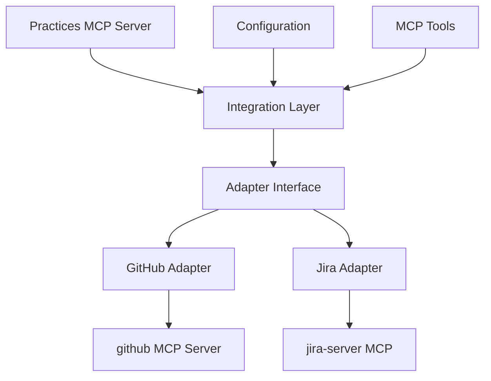
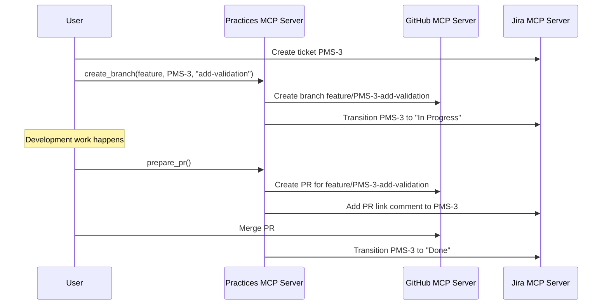
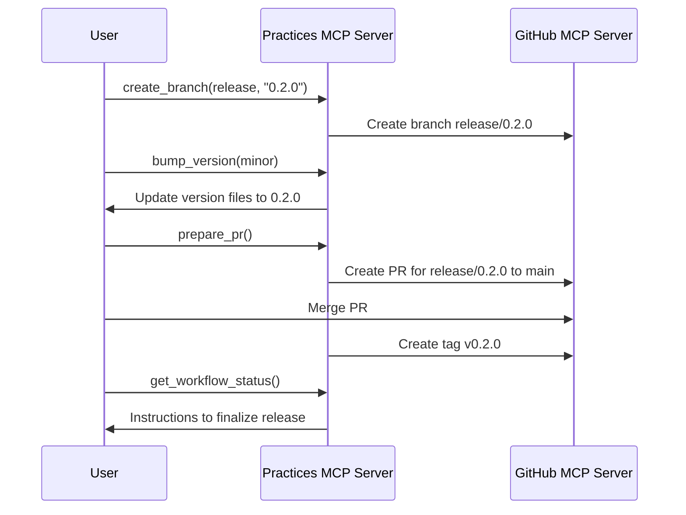

# Practices MCP Server - Integration Adapters

## Overview

The Practices MCP server integrates with other MCP servers to extend its capabilities. This document outlines how integration adapters work, specifically for GitHub and Jira MCP servers, and how they can be used to create a seamless workflow experience.

## Integration Architecture



## Adapter Interface

All integration adapters implement a common interface, which includes:

1. **Connection management**: Authentication and connection handling
2. **Error handling**: Standardized error handling for external services
3. **Resource mapping**: Converting between MCP server resource formats
4. **Configuration**: Adapter-specific configuration options

## GitHub Integration

### Overview

The GitHub integration adapter connects the Practices MCP server to the GitHub MCP server, allowing for seamless interactions with GitHub repositories, branches, and pull requests.

### Setup

The GitHub adapter requires configuration settings in the `.practices.yaml` file:

```yaml
github:
  enabled: true
  create_pr: true
  required_checks: ["tests", "lint"]
```

### Dependencies

- The GitHub MCP server must be available and configured with appropriate credentials.
- Access to the relevant GitHub repositories is required.

### GitHub Adapter API

#### Repository Operations

```python
# Get repository information
repo_info = github_adapter.get_repository_info(owner, repo)

# List branches in a repository
branches = github_adapter.list_branches(owner, repo, pattern=None)

# Get pull requests in a repository
pull_requests = github_adapter.list_pull_requests(owner, repo, state="open")
```

#### Branch Operations

```python
# Create a branch
branch_created = github_adapter.create_branch(owner, repo, branch_name, base_branch)

# Delete a branch
branch_deleted = github_adapter.delete_branch(owner, repo, branch_name)

# Check if a branch exists
branch_exists = github_adapter.branch_exists(owner, repo, branch_name)
```

#### Pull Request Operations

```python
# Create a pull request
pr = github_adapter.create_pull_request(owner, repo, title, body, head, base, draft=False)

# Get pull request details
pr_details = github_adapter.get_pull_request(owner, repo, pr_number)

# Merge a pull request
merge_result = github_adapter.merge_pull_request(owner, repo, pr_number, method="merge")
```

#### File Operations

```python
# Get file contents
file_content = github_adapter.get_file_contents(owner, repo, path, ref=None)

# Update a file
update_result = github_adapter.update_file(owner, repo, path, message, content, branch, sha)
```

### Integration with Practices Tools

The GitHub adapter is used by several Practices MCP tools:

1. **`create_branch`**: Creates branches in GitHub repositories
2. **`prepare_pr`**: Creates pull requests and handles PR preparation
3. **`get_workflow_status`**: Gets information about branches and PRs for workflow guidance

## Jira Integration

### Overview

The Jira integration adapter connects the Practices MCP server to the jira-server MCP, enabling interactions with Jira issues, projects, and workflows.

### Setup

The Jira adapter requires configuration settings in the `.practices.yaml` file:

```yaml
jira:
  enabled: true
  project_key: "PMS"
  transition_to_in_progress: true
  update_on_pr_creation: true
```

### Dependencies

- The jira-server MCP must be available and configured with appropriate credentials.
- Access to the relevant Jira projects is required.

### Jira Adapter API

#### Issue Operations

```python
# Get issue information
issue = jira_adapter.get_issue(issue_key)

# Create an issue
new_issue = jira_adapter.create_issue(project_key, summary, description, issue_type="Task")

# Update an issue
updated_issue = jira_adapter.update_issue(issue_key, summary=None, description=None, assignee=None)

# Transition an issue
transition_result = jira_adapter.transition_issue(issue_key, transition_name)
```

#### Comment Operations

```python
# Add a comment to an issue
comment = jira_adapter.add_comment(issue_key, body)

# Get comments on an issue
comments = jira_adapter.get_comments(issue_key)
```

#### Search Operations

```python
# Search issues using JQL
issues = jira_adapter.search_issues(jql_query)

# Get issues for a project
project_issues = jira_adapter.get_project_issues(project_key)
```

#### User Operations

```python
# Get user information
user = jira_adapter.get_user(email)

# Assign issue to user
assign_result = jira_adapter.assign_issue(issue_key, user_email)
```

### Integration with Practices Tools

The Jira adapter is used by several Practices MCP tools:

1. **`create_branch`**: Updates Jira issues when creating branches
2. **`prepare_pr`**: Links pull requests to Jira issues
3. **`get_workflow_status`**: Gets information about Jira issues for workflow guidance
4. **`update_jira_status`**: Updates Jira issue status directly

## Integration Workflow Examples

### Feature Development Workflow

1. A Jira ticket (PMS-3) is created for a new feature
2. The `create_branch` tool is used to create a feature branch with the ticket ID
3. The Jira adapter transitions the ticket to "In Progress"
4. Development work is completed on the feature branch
5. The `prepare_pr` tool is used to create a PR
6. The GitHub adapter creates the PR on GitHub
7. The Jira adapter adds a comment with the PR link to the Jira ticket
8. The PR is merged via GitHub
9. The Jira adapter transitions the ticket to "Done"



### Release Workflow

1. The `create_branch` tool is used to create a release branch
2. The `bump_version` tool updates version numbers
3. The `prepare_pr` tool creates a PR to merge into `main`
4. The PR is reviewed and merged
5. The GitHub adapter creates a tag for the release version
6. The `get_workflow_status` tool guides the user through the release process



## Error Handling

### Common Error Patterns

Integration adapters follow a standardized error handling approach:

1. **Connection errors**: Unable to connect to the external MCP server
2. **Authentication errors**: Invalid or missing credentials
3. **Permission errors**: Insufficient permissions for operations
4. **Resource not found errors**: Requested resource does not exist
5. **Rate limiting errors**: Exceeded API rate limits

### Error Response Format

Errors are returned in a structured format:

```json
{
  "error": true,
  "code": "INTEGRATION_ERROR",
  "message": "Failed to connect to external service",
  "service": "github",
  "details": {
    "original_error": "Connection refused",
    "request_id": "abc123"
  }
}
```

### Error Handling Strategy

1. **Retry logic**: Automatic retries for transient errors
2. **Circuit breaking**: Prevents cascading failures when services are down
3. **Fallbacks**: Alternative paths when primary service is unavailable
4. **Detailed logging**: Comprehensive error logs for debugging

## Configuration Options

### Common Configuration

```yaml
# Common integration settings
integrations:
  # Enable/disable all integrations
  enabled: true
  # Error handling settings
  error_handling:
    max_retries: 3
    retry_delay: 1.0
    circuit_breaker_threshold: 5
  # Logging settings
  logging:
    level: "INFO"
    include_request_details: true
```

### GitHub Configuration

```yaml
# GitHub integration settings
github:
  enabled: true
  # Repository settings
  repository:
    owner: "organization"
    name: "repo-name"
  # Feature flags
  features:
    create_pr: true
    auto_merge: false
  # CI settings
  ci:
    required_checks: ["tests", "lint"]
    wait_for_checks: true
```

### Jira Configuration

```yaml
# Jira integration settings
jira:
  enabled: true
  # Project settings
  project:
    key: "PMS"
    default_issue_type: "Task"
  # Status workflow
  workflow:
    transition_to_in_progress: true
    transition_on_pr_creation: "In Review"
    transition_on_pr_merge: "Done"
  # Comment settings
  comments:
    add_branch_comment: true
    add_pr_comment: true
    comment_template: "Branch created: {branch_name}"
```

## Security Considerations

1. **Credential Management**: Credentials are never stored in code or configuration files
2. **Least Privilege**: Use tokens with minimal required permissions
3. **Token Rotation**: Support for regular rotation of access tokens
4. **Audit Logging**: Log all operations for security auditing
5. **Sanitization**: Sanitize inputs to prevent injection attacks

## Extensibility

The integration adapter framework is designed to be extensible:

1. **New Adapters**: Additional adapters can be created for other MCP servers
2. **Custom Operations**: Operations can be extended for specific needs
3. **Composable Workflows**: Adapters can be composed to create complex workflows

### Creating a New Adapter

```python
from practices.integrations.adapter import IntegrationAdapter

class NewServiceAdapter(IntegrationAdapter):
    def __init__(self, config):
        super().__init__(config)
        # Initialize adapter-specific state

    def connect(self):
        # Connect to the external service

    def perform_operation(self, params):
        # Implement adapter-specific operation

    # Other required methods
```

### Registering an Adapter

```python
from practices.integrations import register_adapter

# Register the adapter with the integration system
register_adapter("new-service", NewServiceAdapter)
```

## Testing Integration Adapters

Integration adapters include comprehensive testing:

1. **Unit Tests**: Testing adapter logic in isolation
2. **Mock Tests**: Testing with mocked external services
3. **Integration Tests**: Testing with actual external services
4. **Scenario Tests**: Testing common workflow scenarios

### Mock Testing Example

```python
# Test GitHub adapter with mocked GitHub MCP server
def test_github_adapter_create_branch(mocker):
    # Mock the github MCP server
    mock_github_mcp = mocker.patch('practices.integrations.github.github_mcp')
    mock_github_mcp.create_branch.return_value = {'created': True, 'name': 'feature/test'}

    # Create the adapter with test config
    adapter = GitHubAdapter(test_config)

    # Test the adapter
    result = adapter.create_branch('owner', 'repo', 'feature/test', 'main')

    # Assert results
    assert result['created'] is True
    assert result['name'] == 'feature/test'
    mock_github_mcp.create_branch.assert_called_once()
```

## Dependency Management

### MCP Server Dependencies

The integration adapters depend on the following MCP servers:

1. **github MCP server**: For GitHub operations
2. **jira-server MCP**: For Jira operations

### Runtime Dependencies

The integration adapters require:

1. **MCP SDK**: For communicating with MCP servers
2. **PyYAML**: For configuration parsing
3. **Requests**: For HTTP operations

### Optional Dependencies

Some features may require additional dependencies:

1. **GitPython**: For local Git operations
2. **Keyring**: For secure credential storage

These dependencies are marked as optional and only required for specific features.
