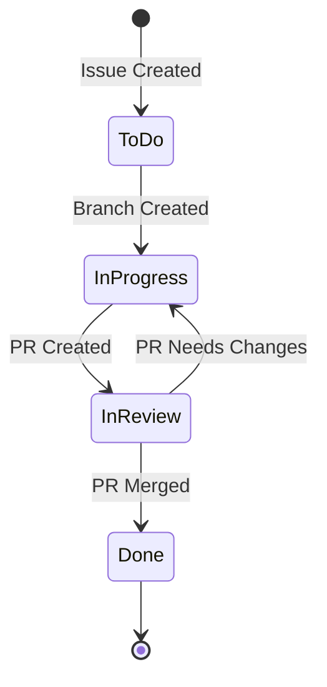
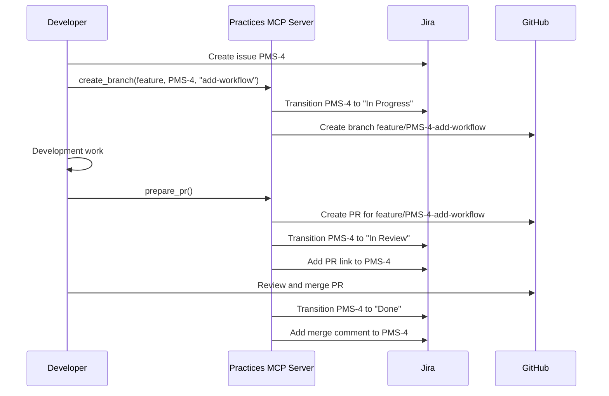

# Practices MCP Server - Jira Workflow

## Overview

This document outlines how the Practices MCP server integrates with Jira through the jira-server MCP to create a seamless workflow between development tasks, source control, and issue tracking. The Jira workflow integration is designed to automate status updates, maintain bidirectional links between code and issues, and provide visibility into development progress.

## Jira Project Configuration

The Practices MCP server is configured to work with the Jira project with key "PMS" (Practices MCP Server). This configuration is specified in the `.practices.yaml` file:

```yaml
jira:
  enabled: true
  project_key: "PMS"
  transition_to_in_progress: true
  update_on_pr_creation: true
  update_on_pr_merge: true
```

## Jira Issue Lifecycle

The Practices MCP server helps manage the Jira issue lifecycle by automating status transitions and maintaining links between development artifacts and Jira issues.



### Issue States

1. **To Do**: The issue is created and awaiting development
2. **In Progress**: Development work has started
3. **In Review**: Code is complete and under review
4. **Done**: The feature/fix has been merged and is complete

## Branch to Issue Relationship

The Practices MCP server enforces a relationship between Git branches and Jira issues through branch naming conventions.

### Branch Naming Format

Feature and bugfix branches follow this naming pattern:

```
feature/PMS-XXX-description
bugfix/PMS-XXX-description
```

Where:
- `PMS` is the Jira project key
- `XXX` is the Jira issue number
- `description` is a hyphenated description of the work

### Automatic Jira Updates

When a branch is created using the `create_branch` tool, the following actions are performed:

1. **Issue Validation**: Verify that the issue exists and can be transitioned
2. **Status Update**: Transition the issue to "In Progress" (if configured)
3. **Comment**: Add a comment to the issue with a link to the branch (if configured)

Example:

```python
# Creating a branch automatically updates Jira
result = create_branch({
  "type": "feature",
  "ticket_id": "PMS-3",
  "description": "add-branch-validation"
})

# Jira issue PMS-3 is now "In Progress" with a comment
```

## Pull Request to Issue Relationship

Pull Requests are linked to Jira issues through both the branch name and explicit references in the PR description.

### PR Description Format

The PR description generated by the `prepare_pr` tool includes:

1. The Jira ticket ID in the title
2. A link to the Jira issue
3. A summary based on the issue description
4. A "Related Issues" section with the issue ID and summary

Example PR description:

```markdown
# PMS-3: Add branch validation

## Summary
This PR implements branch validation functionality (PMS-3).

## Changes
- Implement regex pattern matching for branch names
- Add configuration for branch patterns
- Create validation functions for different branch types

## Testing
- Unit tests for validators
- Integration tests with sample branch names

## Related Issues
- [PMS-3](https://jira.example.com/browse/PMS-3): Implement branch name validation
```

### Automatic Jira Updates on PR Creation

When a PR is created using the `prepare_pr` tool, the following actions are performed:

1. **Status Update**: Transition the issue to "In Review" (if configured)
2. **Comment**: Add a comment to the issue with a link to the PR
3. **PR Link**: Add the PR URL to a custom field on the issue (if configured)

## Merge to Issue Relationship

When PRs are merged, the Practices MCP server can automatically update Jira issues.

### Automatic Jira Updates on PR Merge

When a PR is merged, the following actions are performed:

1. **Status Update**: Transition the issue to "Done" (if configured)
2. **Comment**: Add a comment to the issue with merge information
3. **Resolution**: Set the issue resolution to "Done"

## Jira MCP Tool Integration

The Practices MCP server provides several tools that interact with the jira-server MCP to manage issues.

### `update_jira_status`

Updates the status of a Jira issue.

```python
# Update Jira issue status
result = update_jira_status({
  "ticket_id": "PMS-3",
  "status": "In Progress",
  "comment": "Starting implementation of branch validation"
})
```

### `get_jira_ticket_info`

Retrieves information about a Jira ticket.

```python
# Get Jira ticket details
result = get_jira_ticket_info({
  "ticket_id": "PMS-3"
})
```

### `create_jira_comment`

Adds a comment to a Jira issue.

```python
# Add a comment to a Jira issue
result = create_jira_comment({
  "ticket_id": "PMS-3",
  "comment": "Created branch feature/PMS-3-add-branch-validation"
})
```

## Jira Status Mapping

The Practices MCP server maps development activities to Jira issue statuses:

| Development Activity | Jira Status Transition | Configuration Flag |
|----------------------|------------------------|-------------------|
| Branch Creation      | To Do → In Progress    | transition_to_in_progress |
| PR Creation          | In Progress → In Review | update_on_pr_creation |
| PR Merge             | In Review → Done       | update_on_pr_merge |

This mapping can be customized in the `.practices.yaml` configuration file:

```yaml
jira:
  workflow:
    states:
      development: "In Progress"
      review: "In Review"
      complete: "Done"
    transitions:
      on_branch_create: "In Progress"
      on_pr_create: "In Review"
      on_pr_merge: "Done"
```

## Jira Query Integration

The Practices MCP server provides capabilities to query Jira issues and use the results to guide development workflows.

### Sprint Management

The server can query for issues in the current sprint:

```python
# Get issues in the current sprint
issues = jira_adapter.search_issues('project = PMS AND sprint in openSprints()')
```

### Issue Prioritization

The server can help prioritize work by querying high-priority issues:

```python
# Get high priority issues
issues = jira_adapter.search_issues('project = PMS AND priority in (High, Highest) AND status = "To Do"')
```

## Workflow Examples

### Complete Feature Workflow

1. Create a Jira issue for a new feature (PMS-4)
2. Create a branch using the Practices MCP server
   - Issue PMS-4 transitions to "In Progress"
3. Complete development work on the branch
4. Create a PR using the Practices MCP server
   - Issue PMS-4 transitions to "In Review"
5. Review and merge the PR
   - Issue PMS-4 transitions to "Done"



### Bugfix Workflow

1. Create a Jira issue for a bug (PMS-5)
2. Create a branch using the Practices MCP server
   - Issue PMS-5 transitions to "In Progress"
3. Fix the bug on the branch
4. Create a PR using the Practices MCP server
   - Issue PMS-5 transitions to "In Review"
5. Review and merge the PR
   - Issue PMS-5 transitions to "Done"

## Jira MCP Server Requirements

The Practices MCP server requires the jira-server MCP to be configured with:

1. **Authentication**: Valid API tokens and credentials
2. **Permissions**: Appropriate permissions to view and modify issues
3. **Project Access**: Access to the PMS project

The jira-server MCP is configured in the MCP settings file with credentials for the Jira instance:

```json
{
  "mcpServers": {
    "jira-server": {
      "command": "jira-server",
      "args": [""],
      "disabled": false,
      "env": {
        "JIRA_API_TOKEN": "your-api-token",
        "JIRA_HOST": "your-jira-host",
        "JIRA_EMAIL": "your-email"
      }
    }
  }
}
```

## Security and Privacy Considerations

The Jira integration includes several security and privacy considerations:

1. **API Token Security**: API tokens are stored securely and never exposed in code
2. **Least Privilege**: The integration uses tokens with minimal necessary permissions
3. **Data Minimization**: Only necessary issue data is retrieved and stored
4. **Audit Logging**: All Jira operations are logged for security auditing

## Customizing the Jira Workflow

Users can customize the Jira workflow integration:

1. **Custom Status Mappings**: Map development activities to different Jira statuses
2. **Custom Fields**: Configure which Jira fields to update
3. **Comment Templates**: Customize the format of comments added to issues
4. **Query Templates**: Define custom JQL queries for different operations

Customization is done through the `.practices.yaml` configuration file:

```yaml
jira:
  # ...other settings...
  customization:
    comment_templates:
      branch_created: "Branch created: [{branch_name}]({branch_url})"
      pr_created: "Pull Request created: [{pr_title}]({pr_url})"
    fields:
      pr_link_field: "customfield_10010"
      branch_link_field: "customfield_10011"
```

## Troubleshooting

Common issues and their solutions:

1. **Authentication Failures**:
   - Verify the API token is valid
   - Check that the email matches the token owner

2. **Permission Errors**:
   - Ensure the token has appropriate permissions
   - Check project roles and permissions

3. **Invalid Transitions**:
   - Verify the configured status transitions exist in the workflow
   - Check if the issue is in a state that allows the requested transition

4. **Missing Fields**:
   - Confirm custom field IDs are correct
   - Ensure fields are available for the issue type

5. **Rate Limiting**:
   - Implement backoff strategies
   - Batch updates where possible
