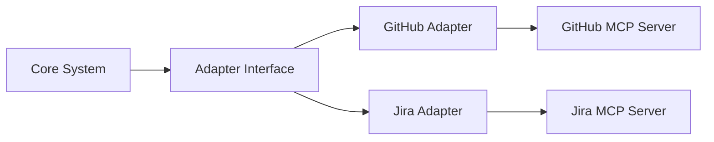

# Practices MCP Server - System Patterns

## Architectural Patterns

The Practices MCP Server follows several architectural patterns to ensure modularity, extensibility, and maintainability:

### 1. Model-Controller Pattern

The server separates data models from the logic that controls them:

- **Models**: Represent entities like branches, versions, and PRs
- **Controllers**: Handle operations on these models (validation, creation, etc.)

This separation helps keep the code organized and maintainable.

### 2. Adapter Pattern

The server uses adapters to integrate with external systems:



This pattern enables:
- Consistent interface for different systems
- Swappable implementations
- Isolation of integration concerns

### 3. Template Method Pattern

The server defines template methods for common workflows, with specific steps implemented by subclasses:

```python
class BaseWorkflow:
    def execute(self):
        self.initialize()
        self.validate()
        self.perform_action()
        self.finalize()

    # Hook methods to be overridden by subclasses
    def initialize(self): pass
    def validate(self): pass
    def perform_action(self): pass
    def finalize(self): pass

class BranchCreationWorkflow(BaseWorkflow):
    def initialize(self):
        # Implementation
        pass

    def validate(self):
        # Implementation
        pass

    # etc...
```

This pattern standardizes workflow processes while allowing customization.

### 4. Factory Pattern

The server uses factories to create objects based on configuration:

```python
class BranchStrategyFactory:
    @staticmethod
    def create_strategy(strategy_type, config):
        if strategy_type == "gitflow":
            return GitFlowStrategy(config)
        elif strategy_type == "github-flow":
            return GitHubFlowStrategy(config)
        elif strategy_type == "trunk":
            return TrunkBasedStrategy(config)
        else:
            raise ValueError(f"Unknown strategy type: {strategy_type}")
```

This pattern centralizes object creation and makes the system more configurable.

### 5. Command Pattern

The server uses the command pattern for operations that can be executed, logged, and potentially undone:

```python
class Command:
    def execute(self): pass
    def undo(self): pass

class BranchCreationCommand(Command):
    def __init__(self, branch_name, base_branch):
        self.branch_name = branch_name
        self.base_branch = base_branch

    def execute(self):
        # Create the branch
        pass

    def undo(self):
        # Delete the branch
        pass
```

This pattern is particularly useful for CLI operations and workflow automation.

## Design Principles

### 1. Configuration-Driven Design

The server is designed to be highly configurable through configuration files:

```yaml
# .practices.yaml
project_type: python
branching_strategy: gitflow
workflow_mode: solo  # "solo" or "team"
main_branch: main
develop_branch: develop

# ... more configuration
```

This enables:
- Customization for different projects
- Adaptation to different workflows
- No hardcoded assumptions

### 2. Single Responsibility Principle

Each module and class has a single responsibility:

- **branch/validator.py**: Only handles branch validation
- **version/bumper.py**: Only handles version bumping
- **pr/generator.py**: Only generates PR descriptions

This makes the codebase easier to understand, maintain, and test.

### 3. Open/Closed Principle

The server is designed to be open for extension but closed for modification:

- Base classes and interfaces define stable contracts
- New functionality is added through extension
- Plugins and adapters can add functionality without modifying core code

### 4. Dependency Injection

The server uses dependency injection to decouple components:

```python
class BranchValidator:
    def __init__(self, config_provider):
        self.config_provider = config_provider

    def validate(self, branch_name):
        config = self.config_provider.get_config()
        # Use config for validation
```

This improves testability and flexibility.

### 5. Template-Based Generation

The server uses templates for generating artifacts:

```markdown
# {ticket_id}: {description}

## Summary
This PR implements {description} functionality ({ticket_id}).

## Changes
-

## Testing
-

## Related Issues
- {ticket_id}: {ticket_description}
```

Templates can be customized and extended for different needs.

## Implementation Patterns

### 1. Resource URIs

The server uses structured URIs for resources:

```
practices://templates/branching-strategy/gitflow
practices://templates/pr/feature
practices://templates/version-files/python
```

These URIs provide a namespaced, hierarchical way to access resources.

### 2. Command-Line Interface Pattern

The CLI follows a consistent pattern:

```
practices <entity> <action> [options]
```

For example:
- `practices branch validate feature/PMS-3-add-validation`
- `practices version bump minor`
- `practices pr prepare --open-browser`

This pattern is intuitive and self-documenting.

### 3. MCP Tool Naming

MCP tools follow a consistent naming pattern:

- `validate_*`: For validation operations
- `get_*_info`: For information retrieval
- `create_*`: For creation operations
- `prepare_*`: For multi-step preparation operations

This consistency makes the API more predictable and easier to use.

### 4. Error Handling Pattern

The server uses a structured approach to error handling:

```json
{
  "error": true,
  "code": "VALIDATION_ERROR",
  "message": "Branch name does not follow convention",
  "details": {
    "branch_name": "invalid-branch",
    "expected_pattern": "feature/([A-Z]+-\\d+)-(.+)"
  }
}
```

This provides detailed, actionable error information.

### 5. Configuration Fallback Pattern

The server uses a fallback pattern for configuration:

1. Check for project-specific configuration
2. Fall back to user configuration
3. Fall back to default templates

This provides flexibility while ensuring sensible defaults.

## Branching and Workflow Patterns

### 1. Workflow Modes

The server supports two workflow modes:

- **Solo Mode**: For single developers or small teams
  - Branch directly from and merge directly to base branches
  - After merging, delete both local and remote feature branches
  - Default mode if not specified

- **Team Mode**: For larger teams or more formal processes
  - Create pull requests for all merges
  - After PR approval and merge, delete both local and remote feature branches

### 2. Repository Initialization

When initializing a Git repository:

- Create `main` and `develop` branches
- Set up default configuration based on project type
- Configure branch protection if in team mode

### 3. Branch Lifecycle

The server manages the complete branch lifecycle:

1. Branch creation from appropriate base
2. Development on branch
3. Branch validation before merge/PR
4. Merge or PR creation
5. Branch cleanup after merge

### 4. Branch Naming Conventions

Branches follow consistent naming conventions:

- `feature/{ticket-id}-{description}` for new features
- `bugfix/{ticket-id}-{description}` for non-critical bugs
- `hotfix/{version}-{description}` for critical production fixes
- `release/{version}` for release preparation
- `docs/{description}` for documentation changes

### 5. Version Management

Version changes are determined by branch type:

- Feature branches don't change version
- Bugfix branches don't change version
- Release branches bump minor or major version
- Hotfix branches bump patch version

## Communication Patterns

### 1. MCP Protocol

The server communicates using the MCP protocol:

```json
{
  "jsonrpc": "2.0",
  "method": "callTool",
  "params": {
    "name": "validate_branch_name",
    "arguments": {
      "branch_name": "feature/PMS-3-add-validation"
    }
  },
  "id": 1
}
```

This standardized protocol enables integration with various MCP clients.

### 2. Event-Based Communication

The server uses events for asynchronous communication:

```python
class EventBus:
    def __init__(self):
        self.subscribers = {}

    def subscribe(self, event_type, callback):
        if event_type not in self.subscribers:
            self.subscribers[event_type] = []
        self.subscribers[event_type].append(callback)

    def publish(self, event_type, event_data):
        if event_type in self.subscribers:
            for callback in self.subscribers[event_type]:
                callback(event_data)
```

This decouples components and enables extensibility.

### 3. Webhook Integration

The server can integrate with webhooks for external events:

```python
def handle_github_webhook(event_type, payload):
    if event_type == "pull_request":
        if payload["action"] == "closed" and payload["pull_request"]["merged"]:
            # Handle PR merge
            pass
```

This enables integration with CI/CD systems and other tools.

## Testing Patterns

### 1. Mock Object Pattern

The server uses mock objects for testing external dependencies:

```python
def test_github_adapter(mocker):
    mock_github = mocker.patch('mcp_server_practices.integrations.github.github_mcp')
    mock_github.create_pr.return_value = {"number": 42, "html_url": "https://github.com/..."}

    adapter = GitHubAdapter(config)
    result = adapter.create_pr(...)

    assert result["pr_number"] == 42
    mock_github.create_pr.assert_called_once()
```

This isolates the system under test.

### 2. Fixture Pattern

The server uses test fixtures for setup and teardown:

```python
@pytest.fixture
def config():
    return {
        "project_type": "python",
        "branching_strategy": "gitflow",
        # ...
    }

def test_branch_validator(config):
    validator = BranchValidator(config)
    # Test with the fixture
```

This reduces duplication and improves test maintainability.

### 3. Parameterized Testing

The server uses parameterized tests for comprehensive coverage:

```python
@pytest.mark.parametrize("branch_name,expected_valid", [
    ("feature/PMS-3-add-validation", True),
    ("feature/add-validation", False),
    ("bugfix/PMS-4-fix-issue", True),
    # ...
])
def test_branch_validation(branch_name, expected_valid, config):
    validator = BranchValidator(config)
    result = validator.validate(branch_name)
    assert result["valid"] == expected_valid
```

This ensures thorough testing of different scenarios.

## Deployment Patterns

### 1. MCP Server Registration

The server is registered in the MCP settings file:

```json
{
  "mcpServers": {
    "practices": {
      "command": "practices-server",
      "args": [],
      "env": {}
    }
  }
}
```

This enables integration with MCP clients.

### 2. Python Package Distribution

The server is distributed as a Python package:

```toml
# pyproject.toml
[project]
name = "mcp-server-practices"
version = "0.1.0"
description = "MCP server for development practices"
# ...

[project.scripts]
practices = "mcp_server_practices.cli:main"
practices-server = "mcp_server_practices.mcp_server:main"
```

This enables easy installation and updates.

### 3. Docker Deployment

The server can be deployed as a Docker container:

```dockerfile
FROM python:3.9

WORKDIR /app

COPY . .
RUN pip install -e .

ENTRYPOINT ["practices-server"]
```

This provides isolation and consistency across environments.
