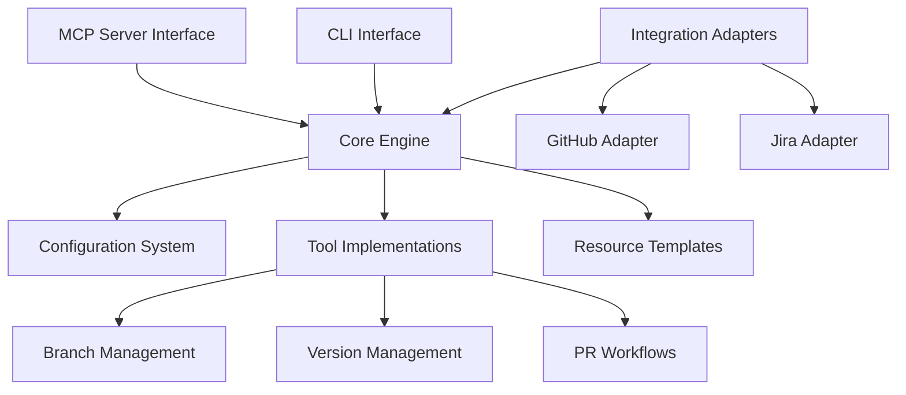

# Practices MCP Server - Technical Context

## Technology Stack

The Practices MCP Server is built using the following technology stack:

### Core Technologies

- **Python 3.9+**: Primary implementation language
- **MCP Python SDK**: For MCP server implementation
- **Git**: The version control system that practices are built around
- **YAML**: For configuration files
- **Markdown**: For templates and documentation

### Dependencies

- **GitPython**: For Git operations
- **PyYAML**: For parsing YAML configuration files
- **Pytest**: For testing
- **Bump2version**: For version management
- **MCP SDK**: For MCP server implementation

### External Integrations

- **github MCP Server**: For GitHub operations
- **jira-server MCP**: For Jira operations

## Architecture Overview

The Practices MCP Server follows a modular architecture:



### Key Components

1. **MCP Server Interface**: Exposes tools and resources via the MCP protocol
2. **Core Engine**: Orchestrates the different components
3. **Configuration System**: Loads and validates project configurations
4. **Tool Implementations**: The actual implementations of the MCP tools
5. **Resource Templates**: Templates for various artifacts
6. **Integration Adapters**: Connect to external MCP servers
7. **CLI Interface**: Command-line interface for direct use

## File Structure

```
mcp_server_practices/
├── src/
│   └── mcp_server_practices/       # Main package
│       ├── __init__.py             # Version info
│       ├── mcp_server.py           # MCP server implementation
│       ├── version/                # Version management
│       │   ├── __init__.py
│       │   ├── validator.py
│       │   └── bumper.py
│       ├── branch/                 # Branch management
│       │   ├── __init__.py
│       │   ├── validator.py
│       │   └── creator.py
│       ├── pr/                     # PR handling
│       │   ├── __init__.py
│       │   ├── generator.py
│       │   └── checker.py
│       ├── integrations/           # External integrations
│       │   ├── __init__.py
│       │   ├── github.py
│       │   └── jira.py
│       └── templates/              # Resource templates
│           ├── __init__.py
│           └── resources.py
├── tests/                          # Test suite
├── .bumpversion.cfg                # Version management configuration
├── pyproject.toml                  # Package metadata
└── README.md                       # Documentation
```

## Project Structure

### MCP Server Entry Point

The main entry point is `mcp_server.py`, which sets up the MCP server and registers tools and resources:

```python
#!/usr/bin/env python

from mcp_python_sdk import Server, StdioTransport

from mcp_server_practices.branch.validator import validate_branch_name
from mcp_server_practices.version.validator import validate_version
# ... other imports

class PracticesServer:
    def __init__(self):
        self.server = Server(
            name="practices",
            version="0.1.0"
        )

        # Register tools
        self.server.add_tool("validate_branch_name", self.validate_branch_name)
        self.server.add_tool("get_branch_info", self.get_branch_info)
        # ... other tools

        # Register resources
        self.server.add_resource_template("practices://templates/branching-strategy/{type}")
        # ... other resources

    def validate_branch_name(self, args):
        # Implementation
        pass

    # ... other methods

    def run(self):
        transport = StdioTransport()
        self.server.connect(transport)
        self.server.run()

if __name__ == "__main__":
    server = PracticesServer()
    server.run()
```

### Configuration Handling

Configurations are loaded from `.practices.yaml` files:

```yaml
# Example configuration
project_type: python
branching_strategy: gitflow
main_branch: main
develop_branch: develop

version:
  files:
    - path: src/package/__init__.py
      pattern: __version__ = "(\d+\.\d+\.\d+)"
  use_bumpversion: true

branches:
  feature:
    pattern: "feature/([A-Z]+-\d+)-(.+)"
    base: develop
    version_bump: null
  # ... other branch types
```

### MCP Tools Exposed

The server exposes tools via the MCP protocol:

1. **Branch Tools**:
   - `validate_branch_name`: Validates branch names
   - `get_branch_info`: Extracts info from branch names
   - `create_branch`: Creates properly named branches

2. **Version Tools**:
   - `validate_version`: Checks version consistency
   - `bump_version`: Bumps version numbers

3. **PR Tools**:
   - `generate_pr_description`: Generates PR descriptions
   - `prepare_pr`: Prepares PRs with checks and descriptions

4. **Integration Tools**:
   - `update_jira_status`: Updates Jira ticket status
   - `create_github_pr`: Creates PRs on GitHub

### Resource Templates

The server provides resource templates for:

1. Branching strategies (GitFlow, GitHub Flow, etc.)
2. PR descriptions (feature, bugfix, release, etc.)
3. Version file formats (Python, JavaScript, etc.)
4. Configuration templates for different project types

## Development Environment

### Setup Requirements

1. Python 3.9+
2. Git
3. MCP Python SDK
4. Development dependencies (pytest, bump2version, etc.)

### Development Workflow

The project follows the same development practices it implements:

1. Feature branches are created from `develop`
2. PRs are created with standardized descriptions
3. Version bumping follows semantic versioning rules
4. Jira tickets are tracked throughout development

### Testing Strategy

1. **Unit Tests**: For individual components
2. **Integration Tests**: For interactions between components
3. **End-to-End Tests**: For complete workflows
4. **Mocked Tests**: For external dependencies

## Development Constraints

### Backwards Compatibility

The server needs to be backwards compatible with Tribal's current implementation to allow for a smooth transition.

### Performance Considerations

The server should have minimal overhead when used in development workflows.

### Security Considerations

1. The server should never store credentials directly
2. It should use secure mechanisms for accessing external services
3. It should validate all inputs to prevent injection attacks

## External Dependencies

### MCP SDK

The server depends on the MCP Python SDK for implementation.

### GitHub MCP Server

The server integrates with the GitHub MCP server for GitHub operations:

```json
{
  "mcpServers": {
    "github": {
      "command": "npx",
      "args": ["-y", "@modelcontextprotocol/server-github"],
      "env": {
        "GITHUB_PERSONAL_ACCESS_TOKEN": "..."
      }
    }
  }
}
```

### Jira MCP Server

The server integrates with the jira-server MCP for Jira operations:

```json
{
  "mcpServers": {
    "jira-server": {
      "command": "jira-server",
      "args": [""],
      "env": {
        "JIRA_API_TOKEN": "...",
        "JIRA_HOST": "...",
        "JIRA_EMAIL": "..."
      }
    }
  }
}
```

## Deployment

The server can be deployed in several ways:

1. **Installed Package**: Using pip to install the package
2. **Docker Container**: Running in a containerized environment
3. **MCP Settings**: Adding to the MCP settings file

## Evolution & Maintenance

The server will evolve over time:

1. **New Strategies**: Adding support for new branching strategies
2. **New Integrations**: Adding integrations with other systems
3. **Enhanced Automation**: Improving automation capabilities
4. **User Feedback**: Incorporating feedback from users
