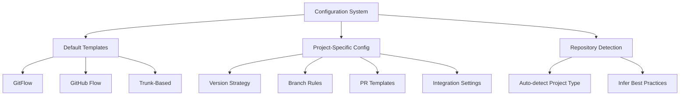

# Practices MCP Server - Configuration System

## Overview

The configuration system for the Practices MCP server is designed to be flexible and adaptable to different project types, languages, and workflows. This document outlines the configuration architecture, file format, schema, and usage patterns.

## Configuration Layers

The Practices MCP server uses a layered configuration approach:



### 1. Default Templates
Built-in configurations for common workflows and project types.

### 2. Project-Specific Configuration
Custom configurations defined in a project configuration file.

### 3. Repository Detection
Automatic detection and suggestion of configuration based on project structure.

## Configuration File

### Location and Name

The configuration file is located in the project root directory and named `.practices.yaml` or `.practices.yml`.

### Format

The configuration file uses YAML format for readability and ease of use.

## Configuration Schema

```yaml
# Basic configuration elements
project_type: python           # Language/framework (python, javascript, java, etc.)
branching_strategy: gitflow    # Branching strategy (gitflow, github-flow, trunk)
main_branch: main              # Primary production branch name
develop_branch: develop        # Development branch name (if applicable)

# Version management
version:
  files:
    - path: src/myproject/__init__.py
      pattern: __version__ = "(\d+\.\d+\.\d+)"
    - path: pyproject.toml
      pattern: version = "(\d+\.\d+\.\d+)"
  use_bumpversion: true
  bumpversion_config: .bumpversion.cfg

# Branch configuration
branches:
  feature:
    pattern: "feature/([A-Z]+-\d+)-(.+)"
    base: develop
    version_bump: null
  bugfix:
    pattern: "bugfix/([A-Z]+-\d+)-(.+)"
    base: develop
    version_bump: null
  release:
    pattern: "release/(\d+\.\d+\.\d+)(?:-(.+))?"
    base: develop
    target: [main, develop]
    version_bump: minor
  hotfix:
    pattern: "hotfix/(\d+\.\d+\.\d+)-(.+)"
    base: main
    target: [main, develop]
    version_bump: patch
  docs:
    pattern: "docs/(.+)"
    base: develop
    version_bump: null

# PR configurations
pull_requests:
  templates:
    feature: templates/pr-feature.md
    bugfix: templates/pr-bugfix.md
    release: templates/pr-release.md
    hotfix: templates/pr-hotfix.md
  checks:
    run_tests: true
    run_linting: true

# Jira integration
jira:
  enabled: true
  project_key: "PMS"
  transition_to_in_progress: true
  update_on_pr_creation: true

# GitHub integration
github:
  enabled: true
  create_pr: true
  required_checks: ["tests", "lint"]
```

## Configuration Sections

### Project Type

The `project_type` field indicates the language or framework of the project, which affects version file patterns, suggested configurations, and other project-specific settings.

Supported project types:
- `python`
- `javascript`
- `typescript`
- `java`
- `csharp`
- `go`
- `rust`
- `generic` (for any other project type)

### Branching Strategy

The `branching_strategy` field defines the overall approach to branching and workflow.

Supported strategies:
- `gitflow` - GitFlow workflow with develop and main branches
- `github-flow` - GitHub Flow with feature branches from main
- `trunk` - Trunk-based development with short-lived feature branches

### Version Management

The `version` section defines how version numbers are stored and managed in the project files.

- `files` - List of files containing version strings
  - `path` - Path to the file relative to project root
  - `pattern` - Regex pattern to match the version string
- `use_bumpversion` - Whether to use bump2version for version management
- `bumpversion_config` - Path to the bump2version configuration file

### Branch Configuration

The `branches` section configures the different branch types, their naming patterns, and behaviors.

For each branch type:
- `pattern` - Regex pattern for the branch name
- `base` - The branch to create from and merge back to
- `target` - List of branches to merge to (for release and hotfix branches)
- `version_bump` - Type of version bump to perform (major, minor, patch, or null)

### PR Configuration

The `pull_requests` section defines how pull requests are generated and validated.

- `templates` - Templates for different PR types
- `checks` - Pre-PR checks to run

### Integration Configuration

#### Jira Integration

The `jira` section configures integration with the Jira MCP server.

- `enabled` - Whether Jira integration is enabled
- `project_key` - The Jira project key
- `transition_to_in_progress` - Whether to automatically transition tickets to In Progress
- `update_on_pr_creation` - Whether to update Jira when PRs are created

#### GitHub Integration

The `github` section configures integration with the GitHub MCP server.

- `enabled` - Whether GitHub integration is enabled
- `create_pr` - Whether to automatically create PRs
- `required_checks` - List of required checks for PRs

## Default Configurations

The Practices MCP server provides default configurations for common project types and branching strategies.

### Default Project Type Configurations

```yaml
# Python default configuration
project_type: python
version:
  files:
    - path: src/<package>/__init__.py
      pattern: __version__ = "(\d+\.\d+\.\d+)"
    - path: pyproject.toml
      pattern: version = "(\d+\.\d+\.\d+)"
  use_bumpversion: true
```

```yaml
# JavaScript/TypeScript default configuration
project_type: javascript
version:
  files:
    - path: package.json
      pattern: "\"version\": \"(\d+\.\d+\.\d+)\""
```

### Default Branching Strategy Configurations

```yaml
# GitFlow default configuration
branching_strategy: gitflow
main_branch: main
develop_branch: develop
branches:
  feature:
    pattern: "feature/([A-Z]+-\d+)-(.+)"
    base: develop
    version_bump: null
  # ... other branch types
```

```yaml
# GitHub Flow default configuration
branching_strategy: github-flow
main_branch: main
branches:
  feature:
    pattern: "feature/([A-Z]+-\d+)-(.+)"
    base: main
    version_bump: null
  # ... other branch types
```

## Configuration Loading Process

1. Look for a `.practices.yaml` file in the project root.
2. If found, parse and validate the configuration.
3. If not found, attempt to detect project type and suggest an appropriate configuration.
4. Merge with default configuration values for the detected project type.
5. Apply the configuration to branch validators, PR generators, etc.

## Project Type Detection

If no configuration file is found, the project type is automatically detected based on the presence of specific files:

- `pyproject.toml` or `setup.py` - Python project
- `package.json` - JavaScript/TypeScript project
- `pom.xml` or `build.gradle` - Java project
- `*.sln` or `*.csproj` - C# project
- `Cargo.toml` - Rust project
- `go.mod` - Go project

## Configuration API

The Practices MCP server provides an API for working with configurations:

1. **Load Configuration**:
   ```python
   config = load_config(project_path)
   ```

2. **Validate Configuration**:
   ```python
   is_valid, errors = validate_config(config)
   ```

3. **Generate Default Configuration**:
   ```python
   default_config = generate_default_config(project_type, branching_strategy)
   ```

4. **Detect Project Type**:
   ```python
   project_type = detect_project_type(project_path)
   ```

## Configuration in MCP Tools

The configuration system integrates with MCP tools by:

1. Loading the configuration when tools are called
2. Providing configuration context to tool implementations
3. Validating operations against the configuration rules

## Multiple Language Support

For monorepos or projects with multiple languages, you can specify multiple version file patterns and configurations:

```yaml
version:
  files:
    # Python files
    - path: src/python_package/__init__.py
      pattern: __version__ = "(\d+\.\d+\.\d+)"
    # JavaScript files
    - path: js/package.json
      pattern: "\"version\": \"(\d+\.\d+\.\d+)\""
```

## Configuration Validation

When loading a configuration file, the Practices MCP server validates:

1. Required fields are present
2. Values are of the correct type
3. Regex patterns are valid
4. Referenced files and paths exist
5. Configuration is consistent and valid

If validation fails, specific error messages are provided to help fix the configuration.
